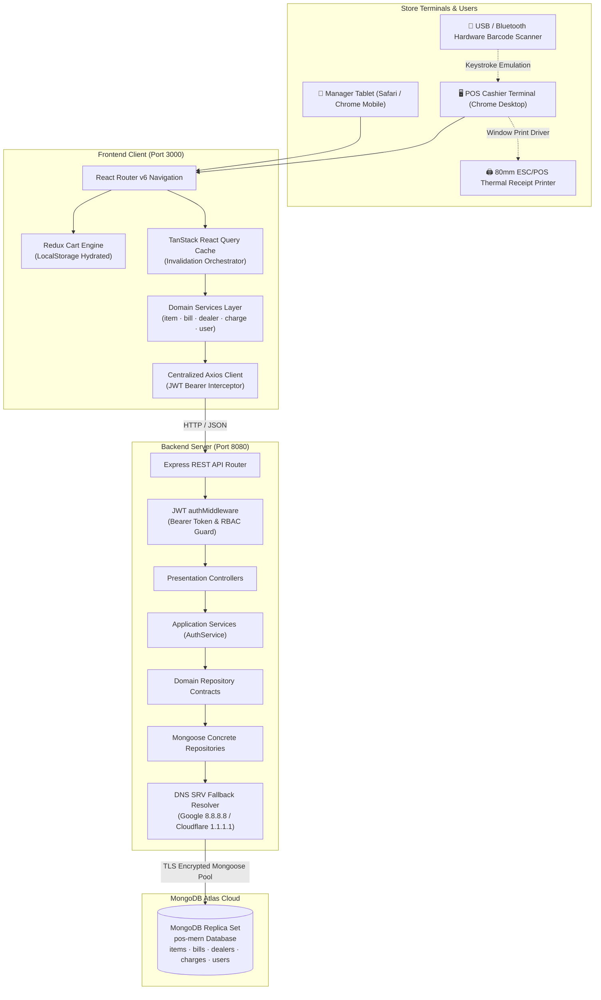
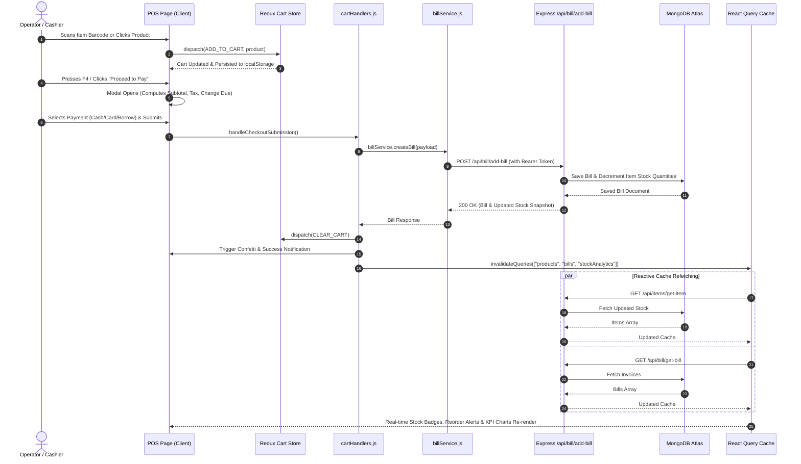
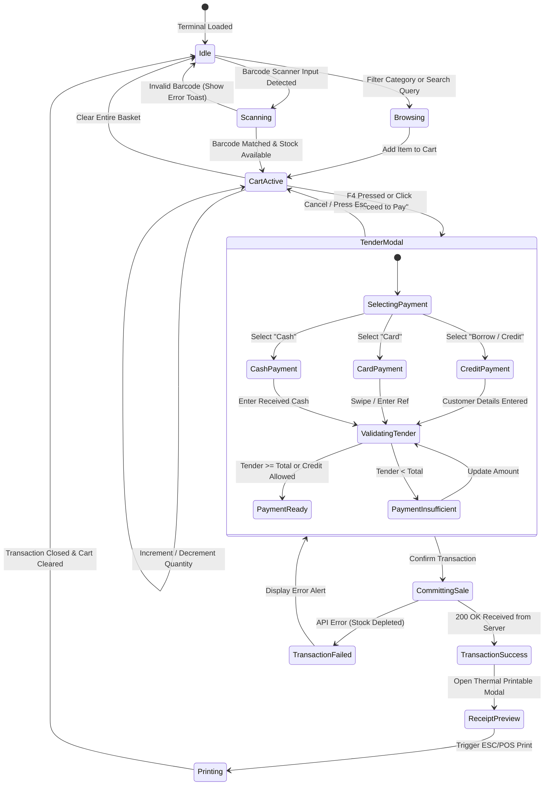
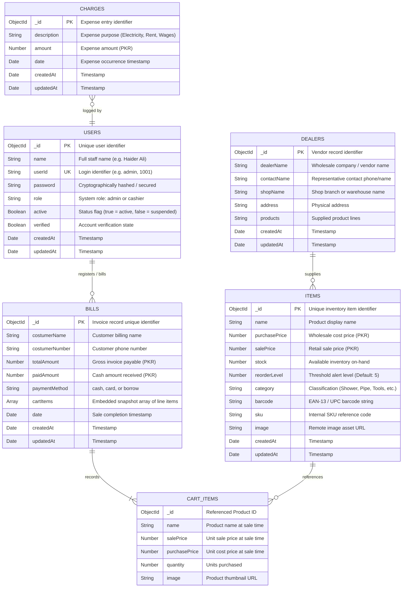

<div align="center">

# 🛒 Hardware Point POS — Enterprise MERN Retail ERP

### Production-Ready, Decoupled Point of Sale with Clean Architecture & Domain-Driven Layering

<p>
  
  
  
  
  
  
  
  
</p>

**A full-stack Point of Sale and Inventory Management System engineered for retail hardware shops, electrical distributors, and multi-counter merchants. Built with Clean Architecture, Domain-Driven Design (DDD), reactive cache invalidation, hardware barcode scanner support, and 80mm thermal receipt printing.**

[Architecture & Design Patterns](#-architecture--software-design-patterns) • [Mermaid Visual Models](#-mermaid-visual-models) • [Folder Structure](#-complete-folder-structure) • [Database Design](#-database-design) • [API Reference](#-api-reference) • [Getting Started](#-getting-started) • [Contributing](#-contributing) • [License](#-license)

---

</div>

> [!IMPORTANT]
> **License Notice**: This software is licensed under the **Hardware Point POS Permission-Based Non-Commercial License**. It is non-paid for approved personal and educational inspection, but **requires prior written permission before usage, deployment, or modification**. Commercial use or resale without written consent is strictly prohibited. See [LICENSE](file:///d:/mern-pos/LICENSE) for terms.

---

## 🎯 Release Highlights & Version Matrix

| Version | Status | Key Highlights |
|:---:|:---:|---|
| **`v2.4.0`** | **Production (Current)** | • **4-Tier Frontend Clean Architecture**: Services, Handlers, Calculators, Presentation.<br>• **Domain-Driven Backend**: Domain Contracts, Infrastructure Repositories, Application Services.<br>• **Zero-Refresh Real-Time Sync**: TanStack Query auto-invalidation on POS mutations.<br>• **Centralized Error Interception**: Global Ant Design notification utility.<br>• **Thermal Printing Isolation**: Scoped 80mm roll printer CSS styling.<br>• **Hardware Scanner Integration**: Keystroke receptor with `F2` focus and `F4` checkout shortcuts. |
| **`v2.0.0`** | Superseded | Introduction of JWT Bearer Authentication, Admin User Management panel, and PrivateRoute guards. |
| **`v1.0.0`** | Deprecated | Legacy prototype with monolithic controllers, plain-text credentials, and manual page refreshes. |

---

## 🏛️ Architecture & Software Design Patterns

Hardware Point POS strictly decouples responsibilities across both client and server according to industry-standard patterns:

```
┌──────────────────────────────────────────────────────────────────────────────────┐
│                            CLIENT SPA (REACT 18)                                 │
│  ┌────────────────────────────────────────────────────────────────────────────┐  │
│  │ Tier 1: Presentation Layer (Ant Design UI, Layout Shell, Responsive Views) │  │
│  └──────────────────────────────────────┬─────────────────────────────────────┘  │
│                                         │ delegates actions & calculations       │
│  ┌──────────────────────────────────────┴─────────────────────────────────────┐  │
│  │ Tier 2: Action Handlers (src/handlers/) & Error Interception               │  │
│  │ Tier 3: Pure Calculators (src/calculaters/ - Math, COGS, Margins, Formats) │  │
│  └──────────────────────────────────────┬─────────────────────────────────────┘  │
│                                         │ fetches / mutates                      │
│  ┌──────────────────────────────────────┴─────────────────────────────────────┐  │
│  │ Tier 4: Service Layer (src/services/) + TanStack Query + Redux Cart Store  │  │
│  └──────────────────────────────────────┬─────────────────────────────────────┘  │
└─────────────────────────────────────────┼────────────────────────────────────────┘
                                          │ HTTP / REST (JWT Bearer Auth)
┌─────────────────────────────────────────▼────────────────────────────────────────┐
│                        BACKEND SERVER (NODE.JS & EXPRESS)                        │
│  ┌────────────────────────────────────────────────────────────────────────────┐  │
│  │ Presentation Layer: Express Routers, Controllers, Auth Middleware          │  │
│  └──────────────────────────────────────┬─────────────────────────────────────┘  │
│                                         │ calls use cases                        │
│  ┌──────────────────────────────────────┴─────────────────────────────────────┐  │
│  │ Application Layer: AuthService & Domain Use Cases                          │  │
│  └──────────────────────────────────────┬─────────────────────────────────────┘  │
│                                         │ implements contracts                   │
│  ┌──────────────────────────────────────┴─────────────────────────────────────┐  │
│  │ Domain Layer: Repository Contracts & Entity Interfaces (DIP)              │  │
│  └──────────────────────────────────────┬─────────────────────────────────────┘  │
│                                         │ concrete persistence                   │
│  ┌──────────────────────────────────────┴─────────────────────────────────────┐  │
│  │ Infrastructure Layer: Mongoose Repositories, Jose Token Signer, DNS Pool   │  │
│  └──────────────────────────────────────┬─────────────────────────────────────┘  │
└─────────────────────────────────────────┼────────────────────────────────────────┘
                                          │ TCP / SRV Pool (8.8.8.8 Fallback)
                               ┌──────────▼──────────┐
                               │    MONGODB ATLAS    │
                               │  Primary & Replicas │
                               └─────────────────────┘
```

### Key Architectural Patterns Implemented

1. **Domain-Driven Design (DDD) & Hexagonal Architecture (Server)**:
   - Business entities and repository contracts (`src/domain/`) are decoupled from Mongoose schemas.
   - Concrete implementations live in `src/infrastructure/repositories/MongooseUserRepository.js`.
   - The application service (`src/application/services/AuthService.js`) depends only on abstractions.
2. **Dependency Inversion Principle (DIP)**:
   - High-level business logic is decoupled from database drivers. Swapping MongoDB for PostgreSQL requires only implementing the repository contract without touching application services.
3. **Facade Pattern (Client Services)**:
   - Components and hooks interact with dedicated service modules (`productService.js`, `billService.js`, etc.) that abstract away network details, serialization, and Axios configurations.
4. **Strategy Pattern (Pure Calculators)**:
   - Financial algorithms (gross revenue, COGS, net margins, category valuations, tax, tender change) are isolated into pure functions inside `src/calculaters/`. They have zero side effects and are 100% testable.
5. **Chain of Responsibility / Interceptor Pattern**:
   - Outgoing Axios requests automatically inject the JWT Bearer token.
   - Centralized error utility (`src/utils/errorHandler.js`) intercepts failures, parses error payloads, and triggers uniform Ant Design notifications.
6. **CQRS-Lite State Synchronization**:
   - **Command / Local State**: Active cart operations (`ADD_TO_CART`, `UPDATE_CART`, `DELETE_FROM_CART`) are processed synchronously via Redux and hydrated from `localStorage`.
   - **Query / Server State**: Products, bills, analytics, dealers, and users are managed by TanStack React Query with automated cache invalidation upon mutations.

---

## 📊 Mermaid Visual Models

### 1. High-Level Enterprise Topology



---

### 2. POS Transaction & Cache Invalidation Lifecycle



---

### 3. POS Active Transaction State Machine



---

### 4. Multi-Role RBAC Authorization Flow


---

## 🗄️ Database Design

### Comprehensive Entity Relationship Diagram (ERD)



---

## 📂 Complete Folder Structure

```
📂 mern-pos/                                      # Monorepo Workspace Root
├── 📄 .env.example                               # Global environment template
├── 📄 CONTRIBUTING.md                            # Comprehensive contributor guidelines
├── 📄 LICENSE                                    # Custom Permission-Based License
├── 📄 package.json                               # Concurrently orchestrator scripts
├── 📄 README.md                                  # Root architectural blueprint
│
├── 📁 server/                                    # Express & Node.js Backend
│   ├── 📄 .env.example                           # Server environment blueprint
│   ├── 📄 package.json                           # Backend dependencies & scripts
│   ├── 📄 server.js                              # Express HTTP Server entry point (:8080)
│   ├── 📄 seeders.js                             # Seed master admin & sample cashier
│   ├── 📁 config/
│   │   └── 📄 config.js                          # Mongoose connection with DNS fallbacks
│   └── 📁 src/                                   # Domain-Driven Clean Architecture
│       ├── 📁 domain/
│       │   └── 📁 repositories/
│       │       └── 📄 RepositoryContracts.js     # Abstract UserRepository contract
│       ├── 📁 application/
│       │   └── 📁 services/
│       │       └── 📄 AuthService.js             # Auth, status toggle, role use cases
│       ├── 📁 infrastructure/
│       │   ├── 📁 repositories/
│       │   │   └── 📄 MongooseUserRepository.js  # Concrete Mongoose implementation
│       │   └── 📁 security/
│       │       └── 📄 JoseTokenSigner.js         # JWT signing and verification engine
│       └── 📁 presentation/
│           ├── 📁 controllers/
│           │   ├── 📄 userController.js          # Admin & login HTTP handlers
│           │   ├── 📄 itemController.js          # Product catalog HTTP handlers
│           │   ├── 📄 billController.js          # Billing & stock decrement handlers
│           │   ├── 📄 dealerController.js        # Supplier directory HTTP handlers
│           │   └── 📄 chargesController.js       # Expense tracking HTTP handlers
│           ├── 📁 middleware/
│           │   └── 📄 authMiddleware.js          # verifyToken & requireRole guards
│           └── 📁 routes/
│               ├── 📄 userRoutes.js              # /api/users routes
│               ├── 📄 itemRoutes.js              # /api/items routes
│               ├── 📄 billRoutes.js              # /api/bill routes
│               ├── 📄 dealerRoutes.js            # /api/dealers routes
│               └── 📄 chargesRoutes.js           # /api/charges routes
│
└── 📁 client/                                    # React 18 & Ant Design Frontend
    ├── 📄 .env.example                           # Frontend environment blueprint
    ├── 📄 package.json                           # CRA dependencies, scripts & proxy
    ├── 📄 README.md                              # Dedicated frontend architecture docs
    ├── 📁 public/
    │   └── 📄 index.html                         # HTML template shell
    └── 📁 src/                                   # 4-Tier Clean Frontend Architecture
        ├── 📄 index.js                           # App root, React Query, RAF ResizeObserver
        ├── 📄 index.css                          # Global typography & print overrides
        ├── 📄 App.js                             # React Router v6 & PrivateRoute guards
        ├── 📁 api/
        │   └── 📄 client.js                      # Axios instance with Bearer interceptor
        ├── 📁 services/                          # Tier 4: Remote API Service Modules
        │   ├── 📄 productService.js              # Item API abstraction
        │   ├── 📄 billService.js                 # Invoice & Checkout API abstraction
        │   ├── 📄 dealerService.js               # Vendor API abstraction
        │   ├── 📄 chargeService.js               # Expense API abstraction
        │   ├── 📄 userService.js                 # User & RBAC API abstraction
        │   └── 📄 index.js                       # Barrel export for services
        ├── 📁 handlers/                          # Tier 2: Action & Event Handlers
        │   ├── 📄 posHandlers.js                 # Add to cart & barcode scan orchestration
        │   ├── 📄 billsHandlers.js               # Bill CRUD & modal submission handlers
        │   ├── 📄 cartHandlers.js                # Checkout mutation & confetti handlers
        │   ├── 📄 itemHandlers.js                # Product CRUD & validation handlers
        │   └── 📄 stockHandlers.js               # Stock analytics event handlers
        ├── 📁 calculaters/                       # Tier 3: Pure Mathematical Calculators
        │   ├── 📄 billCalculations.js            # Revenue aggregations & date formatters
        │   ├── 📄 stockCalculations.js           # Valuation, COGS, profits, margins
        │   ├── 📄 cartCalculations.js            # Cart subtotals, line totals, change due
        │   ├── 📄 itemCalculations.js            # Unit stats, categories index, badges
        │   └── 📄 posCalculations.js             # Catalog search algorithms & barcode match
        ├── 📁 hooks/                             # Custom React Hooks
        │   ├── 📄 usePosQueries.js               # Centralized TanStack Query cache hooks
        │   ├── 📄 useBarcodeScanner.js           # Hardware scanner keystroke listener
        │   └── 📄 usePosShortcuts.js             # F2, F4, Esc, Ctrl+K keyboard bindings
        ├── 📁 redux/                             # Local UI State Management
        │   ├── 📄 store.js                       # Redux store with thunk middleware
        │   └── 📄 rootReducer.js                 # Persistent cart reducer & boundary checks
        ├── 📁 pages/                             # Tier 1: Pure Presentation Components
        │   ├── 📄 Homepage.js                    # POS active retail terminal
        │   ├── 📄 Cartpage.js                    # Cart review & modal payment terminal
        │   ├── 📄 Billspage.js                   # Invoices log & 80mm printable receipt
        │   ├── 📄 Itempage.js                    # Inventory catalog directory & CRUD
        │   ├── 📄 Stockpage.js                   # Financial analytics & Recharts dashboard
        │   ├── 📄 UserManagement.js              # Admin operator RBAC management panel
        │   ├── 📄 Dealerspage.js                 # Wholesale supplier directory
        │   ├── 📄 Charges.js                     # Operational store expenses log
        │   ├── 📄 LoginForm.js                   # Operator login authentication
        │   └── 📄 ChangePasswordForm.js          # Operator credential reset
        ├── 📁 components/                        # Shared UI Components
        │   ├── 📄 Defaultlayouts.js              # App shell, responsive sider & mobile drawer
        │   ├── 📄 PrivateRoute.js                # Role-based route authorization guard
        │   └── 📄 ItemsList.js                   # Legacy product card component
        ├── 📁 styles/                            # CSS Stylesheets
        │   ├── 📄 Pos.css                        # POS grid, product cards & cart dock styles
        │   └── 📄 Defaultlayouts.css             # Theme variables & responsive breakpoints
        └── 📁 utils/                             # Shared Utilities
            └── 📄 errorHandler.js                # Centralized Ant Design toast interceptor
```

---

## 📡 REST API Reference

**Base URL:** `http://localhost:8080/api`

| Module | Method | Endpoint | Access Level | Description |
|---|---|---|:---:|---|
| **Auth** | `POST` | `/users/login` | Public | Authenticate operator, returns JWT token & user profile |
| **Auth** | `POST` | `/users/register` | Public | Operator self-registration (if permitted) |
| **Auth** | `POST` | `/users/reset-password` | Public | Reset password with name and user ID verification |
| **Users** | `GET` | `/users/get-users` | `admin` | Retrieve all staff accounts (with `/all` alias) |
| **Users** | `POST` | `/users/admin-create` | `admin` | Provision a new operator with role assignment |
| **Users** | `PATCH` | `/users/toggle-status` | `admin` | Activate or suspend operator access (`{ userId, active }`) |
| **Users** | `PATCH` | `/users/update-role` | `admin` | Promote or demote operator (`{ userId, role }`) |
| **Users** | `DELETE` | `/users/delete/:userId` | `admin` | Permanently delete operator account |
| **Catalog** | `GET` | `/items/get-item` | Public | Fetch product catalog with live stock counts |
| **Catalog** | `POST` | `/items/add-item` | Authenticated | Create a new inventory record |
| **Catalog** | `PUT` | `/items/edit-item` | Authenticated | Update product prices, stock, or reorder threshold |
| **Catalog** | `POST` | `/items/delete-item` | Authenticated | Remove product item from database (`{ itemId }`) |
| **Billing** | `GET` | `/bill/get-bill` | Authenticated | Retrieve customer invoices and transaction records |
| **Billing** | `POST` | `/bill/add-bill` | Authenticated | Complete checkout, record invoice & decrement inventory |
| **Billing** | `PUT` | `/bill/edit-bill` | Authenticated | Edit customer information or payment status |
| **Billing** | `DELETE` | `/bill/delete-bill/:id` | Authenticated | Delete invoice record |
| **Dealers** | `GET` | `/dealers/get-dealers` | Authenticated | List all wholesale supplier profiles |
| **Dealers** | `POST` | `/dealers/add-dealer` | Authenticated | Register a new wholesale supplier |
| **Dealers** | `PUT` | `/dealers/edit-dealer` | Authenticated | Update supplier contact information |
| **Dealers** | `POST` | `/dealers/delete-dealer` | Authenticated | Remove supplier record |
| **Charges** | `GET` | `/charges/get-charges` | Authenticated | Retrieve store operating expenses |
| **Charges** | `POST` | `/charges/add-charge` | Authenticated | Record an expense line |
| **Charges** | `PUT` | `/charges/edit-charge` | Authenticated | Update expense details |
| **Charges** | `POST` | `/charges/delete-charge` | Authenticated | Delete expense record |

---

## 🚀 Getting Started

### 1. Prerequisites
- **Node.js**: `v18.x` or later
- **npm**: `v9.x` or later
- **MongoDB**: Local MongoDB instance or MongoDB Atlas cluster

### 2. Environment Configuration
Copy the provided `.env.example` templates:

```bash
# Backend Environment
cp server/.env.example server/.env

# Frontend Environment
cp client/.env.example client/.env
```

Ensure `server/.env` includes your MongoDB connection string and a secure JWT secret:
```env
PORT=8080
MONGOS_URI=mongodb+srv://<username>:<password>@cluster0.mongodb.net/pos-mern?retryWrites=true&w=majority
JWT_SECRET=your-secure-jwt-secret-key
JWT_EXPIRES_IN=8h
```

### 3. Dependency Installation
```bash
# Install root orchestration tools
npm install

# Install server packages
cd server && npm install && cd ..

# Install client packages
cd client && npm install && cd ..
```

### 4. Database Seeding
Initialize the master administrator and sample cashier account:
```bash
cd server
npm run seed
cd ..
```

Default credentials:
- **Admin**: User ID `admin` · Password `test123`
- **Cashier**: User ID `1001` · Password `test123`

### 5. Launch Full Stack Development
```bash
npm run dev
```

- **Frontend Client**: `http://localhost:3000`
- **Backend API**: `http://localhost:8080`

---

## 🤝 Contributing

Contributions must adhere to the layered architecture guidelines, conventional commit syntax, and verification requirements. Please read [`CONTRIBUTING.md`](file:///d:/mern-pos/CONTRIBUTING.md) before submitting pull requests.

---

## 📄 License

This software is governed by the **Hardware Point POS Permission-Based Non-Commercial License**.

- **Permission Required**: You must request and receive prior written consent from author [Haider Ali](https://github.com/Haiderali445) before running, modifying, or distributing this software.
- **Non-Paid**: Free of monetary subscription charges for approved personal, research, and non-commercial educational use.
- **No Commercial Resale**: Commercial redistribution, sale, or SaaS deployment is strictly prohibited without an executed commercial license.

See the full [LICENSE](file:///d:/mern-pos/LICENSE) file for complete terms.

Copyright © 2024–2026 [Haider Ali](https://github.com/Haiderali445). All rights reserved.
