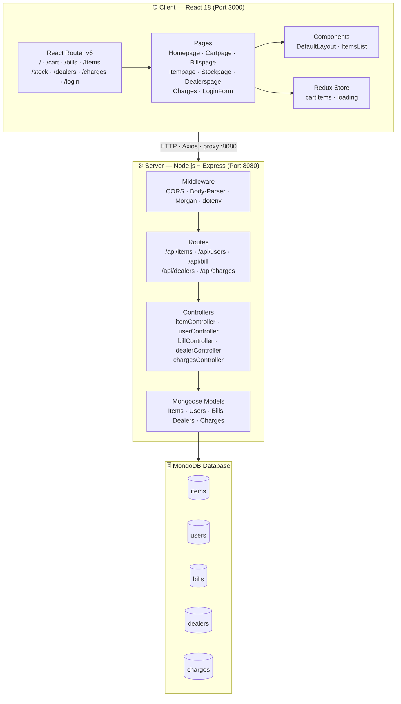
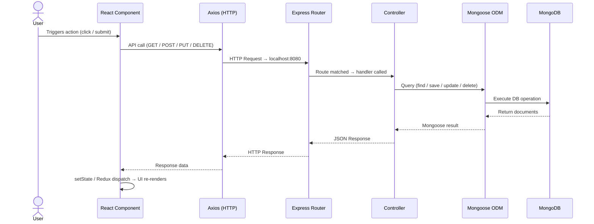
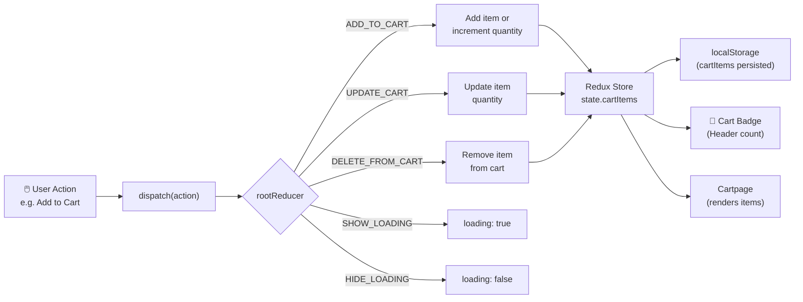
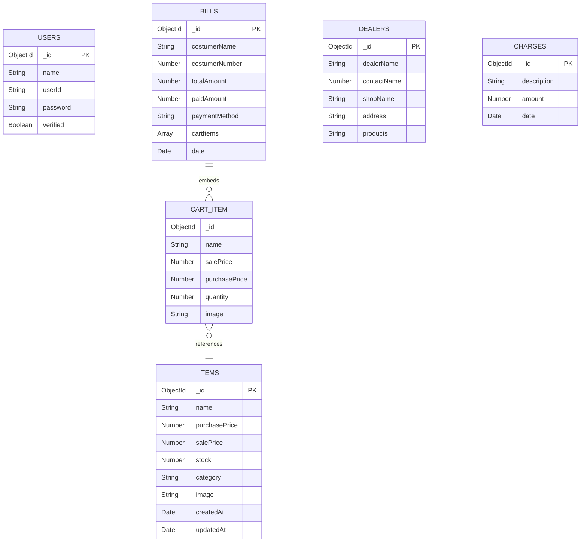
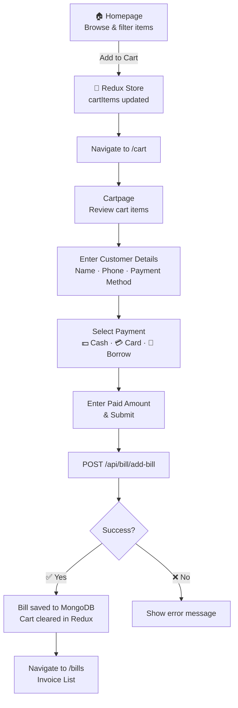
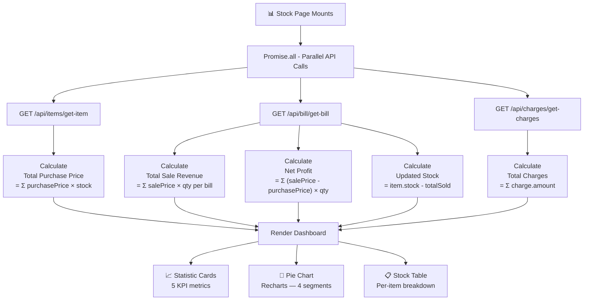
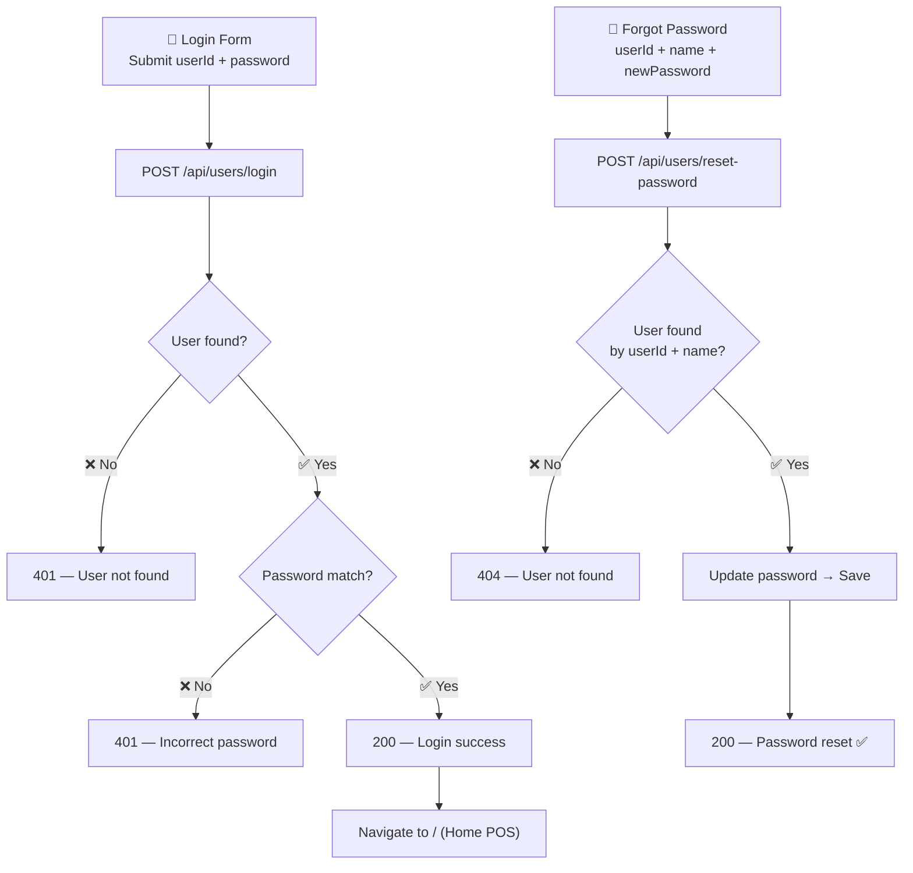
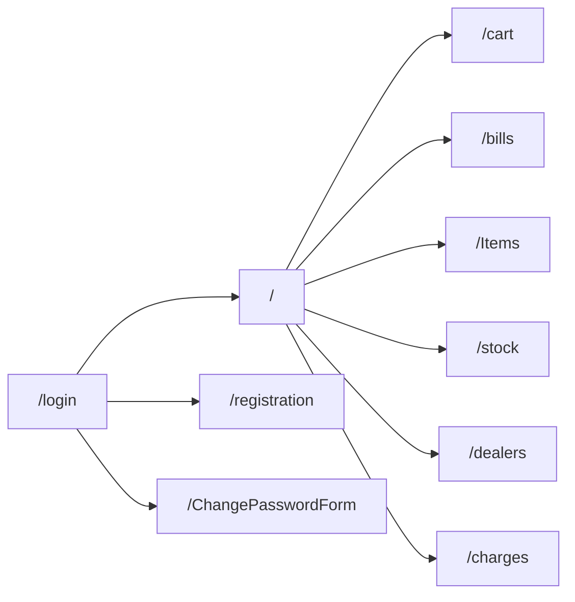

<div align="center">

# 🛒 MERN POS System

### Hardware Point of Sale — Full Stack MERN Application

<p>
  
  
  
  
  
  
  
</p>

**A full-stack Point of Sale system built for hardware retail shops — featuring inventory management, real-time billing, dealer tracking, expense logging, and business analytics with live charts.**

[Features](#-features) • [Architecture](#-architecture) • [Database Design](#-database-design) • [Tech Stack](#-tech-stack) • [API Reference](#-api-reference) • [Getting Started](#-getting-started)

---

</div>

## 🎯 Overview

**MERN POS** streamlines hardware shop operations from a single dashboard — browse products, manage a cart, generate invoices, track stock levels, and monitor business profitability all in one place.

---

## ✨ Features

| Module | Capabilities |
|--------|-------------|
| 🔐 **Authentication** | Login, Register, Forgot Password |
| 🏠 **Home / POS** | Browse & filter items by category, search by name, add to cart |
| 🛒 **Cart** | Add / remove / update quantities, checkout |
| 🧾 **Billing** | Create, view, edit, delete invoices; search by customer phone |
| 📦 **Inventory** | Full CRUD for products with image, prices, stock, category |
| 📊 **Stock Analytics** | Profit, revenue, purchase cost, remaining stock value, pie chart |
| 🤝 **Dealers** | Supplier directory — add, edit, delete |
| 💸 **Charges** | Operational expense tracker — add, edit, delete |

---

## 🏗️ Architecture

### System Architecture



---

### Request / Response Flow



---

### Redux State Flow



---

## 🗄️ Database Design

### Entity Relationship Diagram



### Collections at a Glance

| Collection | Purpose | Notable Fields |
|-----------|---------|----------------|
| `items` | Product catalog | `purchasePrice`, `salePrice`, `stock`, `category`, `image` |
| `users` | Staff accounts | `userId`, `password`, `verified` |
| `bills` | Sales invoices | `paymentMethod` (cash/card/borrow), `cartItems[]`, `date` |
| `dealers` | Supplier directory | `dealerName`, `shopName`, `address` |
| `charges` | Business expenses | `description`, `amount` |

---

## 🔄 Data Flow Diagrams

### Checkout / Billing Flow



---

### Stock Analytics Flow



---

### Authentication Flow



---

## 🔧 Tech Stack

### Frontend

| Technology | Version | Purpose |
|-----------|---------|---------|
| **React** | 18.2.0 | Core UI framework |
| **React Router DOM** | 6.21.1 | Client-side routing |
| **Redux** | 5.0.1 | Global state management |
| **React Redux** | 9.0.4 | React-Redux bindings |
| **Redux Thunk** | 3.1.0 | Async action middleware |
| **Ant Design** | 5.12.6 | UI component library |
| **Axios** | 1.6.3 | HTTP API client |
| **Recharts** | 2.12.6 | Data visualisation (Pie chart) |
| **date-fns** | 3.6.0 | Date formatting |

### Backend

| Technology | Version | Purpose |
|-----------|---------|---------|
| **Node.js** | 18.x+ | JavaScript runtime |
| **Express.js** | 4.18.2 | REST API framework |
| **Mongoose** | 8.0.3 | MongoDB ODM |
| **cors** | 2.8.5 | Cross-Origin middleware |
| **body-parser** | 1.20.2 | Request body parsing |
| **dotenv** | 16.3.1 | Environment variables |
| **morgan** | 1.10.0 | HTTP request logger |
| **bcrypt** | 5.1.1 | Password hashing |
| **jsonwebtoken** | 9.0.2 | JWT auth tokens |
| **nodemailer** | 6.9.13 | Email utility |
| **nodemon** | 3.0.2 | Auto-restart in dev |
| **concurrently** | 8.2.2 | Run client + server together |

---

## 📡 API Reference

**Base URL:** `http://localhost:8080`

### 👤 `/api/users`

| Method | Endpoint | Description | Body |
|--------|----------|-------------|------|
| `POST` | `/login` | Authenticate user | `{ userId, password }` |
| `POST` | `/register` | Create new account | `{ name, userId, password }` |
| `POST` | `/reset-password` | Reset password | `{ userId, name, newPassword }` |

### 📦 `/api/items`

| Method | Endpoint | Description | Body |
|--------|----------|-------------|------|
| `GET` | `/get-item` | Fetch all items | — |
| `POST` | `/add-item` | Create item | `{ name, purchasePrice, salePrice, stock, category, image }` |
| `PUT` | `/edit-item` | Update item | `{ _id, ...fields }` |
| `POST` | `/delete-item` | Delete item | `{ _id }` |

### 🧾 `/api/bill`

| Method | Endpoint | Description | Body |
|--------|----------|-------------|------|
| `GET` | `/get-bill` | Fetch all bills | — |
| `POST` | `/add-bill` | Create invoice | `{ costumerName, costumerNumber, totalAmount, paidAmount, paymentMethod, cartItems }` |
| `PUT` | `/edit-bill` | Update bill | `{ billId, ...fields }` |
| `DELETE` | `/delete-bill/:id` | Delete bill | — |

### 🤝 `/api/dealers`

| Method | Endpoint | Description | Body |
|--------|----------|-------------|------|
| `GET` | `/get-dealers` | Fetch all dealers | — |
| `POST` | `/add-dealer` | Add dealer | `{ dealerName, contactName, shopName, address, products }` |
| `PUT` | `/edit-dealer` | Update dealer | `{ ...fields }` |
| `POST` | `/delete-dealer` | Delete dealer | `{ _id }` |

### 💸 `/api/charges`

| Method | Endpoint | Description | Body |
|--------|----------|-------------|------|
| `GET` | `/get-charges` | Fetch all charges | — |
| `POST` | `/add-charge` | Log expense | `{ description, amount }` |
| `PUT` | `/edit-charge` | Update charge | `{ ...fields }` |
| `POST` | `/delete-charge` | Delete charge | `{ _id }` |

---

## 📁 Project Structure

```
mern-pos/
├── server.js                     # Express entry point (Port 8080)
├── package.json                  # Backend dependencies + scripts
├── seeders.js                    # Database seeder
├── .env                          # Environment variables (not committed)
├── config/
│   └── config.js                 # MongoDB connection
├── models/
│   ├── userModels.js
│   ├── itemModels.js
│   ├── billaModels.js
│   ├── dealerModels.js
│   └── chargesModels.js
├── controller/
│   ├── userController.js
│   ├── itemController.js
│   ├── billController.js
│   ├── dealerController.js
│   └── chargesController.js
├── route/
│   ├── userRoutes.js             # /api/users
│   ├── itemRoutes.js             # /api/items
│   ├── billRoutes.js             # /api/bill
│   ├── dealerRoutes.js           # /api/dealers
│   └── chargesRoutes.js          # /api/charges
└── client/                       # React app (CRA)
    └── src/
        ├── App.js                # Root + Router
        ├── pages/
        │   ├── Homepage.js       # POS browse page
        │   ├── Cartpage.js       # Cart + checkout
        │   ├── Billspage.js      # Invoice management
        │   ├── Itempage.js       # Inventory CRUD
        │   ├── Stockpage.js      # Analytics + charts
        │   ├── Dealerspage.js    # Dealer CRUD
        │   ├── Charges.js        # Expense CRUD
        │   └── LoginForm.js      # Auth
        ├── components/
        │   ├── Defaultlayouts.js # Sidebar + Header
        │   └── ItemsList.js      # Product card
        ├── redux/
        │   ├── store.js
        │   └── rootReducer.js
        └── styles/
            └── Defaultlayouts.css
```

---

## 🚀 Getting Started

### Prerequisites

- Node.js `>= 16.x`
- npm `>= 8.x`
- MongoDB (local or [Atlas](https://www.mongodb.com/atlas/database))

### Setup

```bash
# 1. Clone
git clone https://github.com/Haiderali445/mern-pos.git
cd mern-pos

# 2. Create .env in project root
MONGOS_URI=mongodb://localhost:27017/mern-pos
PORT=8080

# 3. Install dependencies
npm install
npm install --prefix client

# 4. (Optional) Seed the database
npm run seed

# 5. Start — runs both client and server
npm run dev
```

| Service | URL |
|---------|-----|
| Frontend | `http://localhost:3000` |
| Backend API | `http://localhost:8080` |

---

## 📜 Scripts

| Script | Description |
|--------|-------------|
| `npm run dev` | Run full stack (client + server concurrently) |
| `npm run server` | Backend only with nodemon |
| `npm run client` | Frontend only (React dev server) |
| `npm start` | Production backend |
| `npm run seed` | Seed the database |

---

## 🌍 Environment Variables

| Variable | Required | Description |
|----------|----------|-------------|
| `MONGOS_URI` | ✅ | MongoDB connection URI |
| `PORT` | ❌ | Server port (default `8080`) |

---

## 🗺️ Route Map



---

## 🐛 Known Issues & Roadmap

### Current Issues

- [ ] Passwords stored in plain text — `bcrypt` installed but not implemented
- [ ] No JWT token issued on login — session not secured
- [ ] No route guards — all pages accessible without login
- [ ] `billaModels.js`: `{ timestamp: true }` should be `{ timestamps: true }`
- [ ] `dealerModels.js`: `contactName` typed as `Number`, should be `String`

### Planned Features

- [ ] JWT authentication + protected routes
- [ ] bcrypt password hashing
- [ ] Role-based access control (Admin / Cashier)
- [ ] PDF invoice generation
- [ ] Sales trend bar charts (monthly / weekly)
- [ ] Low-stock alerts
- [ ] Customer credit / borrow ledger

---

## 🤝 Contributing

```bash
git checkout -b feature/your-feature
git commit -m "feat: describe your change"
git push origin feature/your-feature
# Open a Pull Request
```

**Commit prefixes:** `feat` · `fix` · `docs` · `style` · `refactor` · `test` · `chore`

---

## 📄 License

MIT License — © 2024 [Haiderali445](https://github.com/Haiderali445)

---

<div align="center">

⭐ **Star this repo if you find it useful!** ⭐

`MongoDB` · `Express.js` · `React.js` · `Node.js` · `Redux` · `Ant Design` · `Recharts`

</div>
