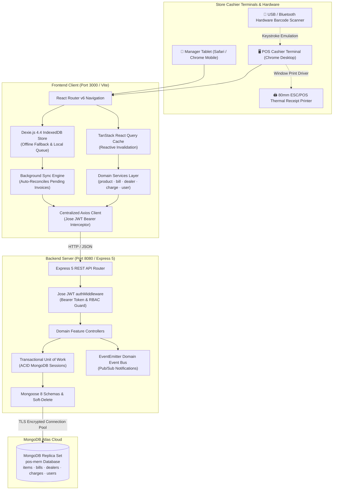
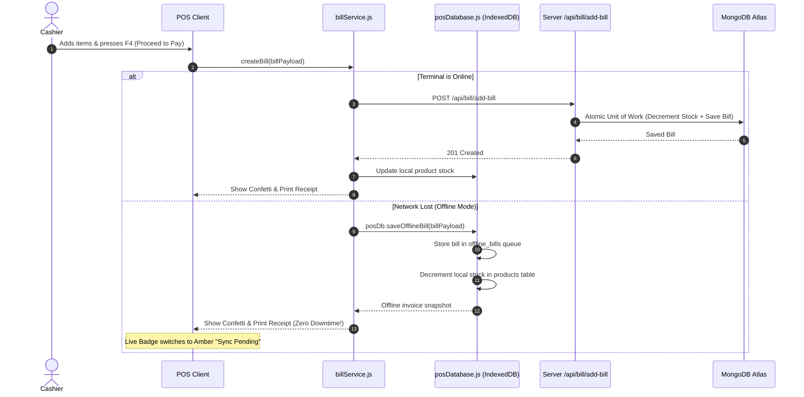
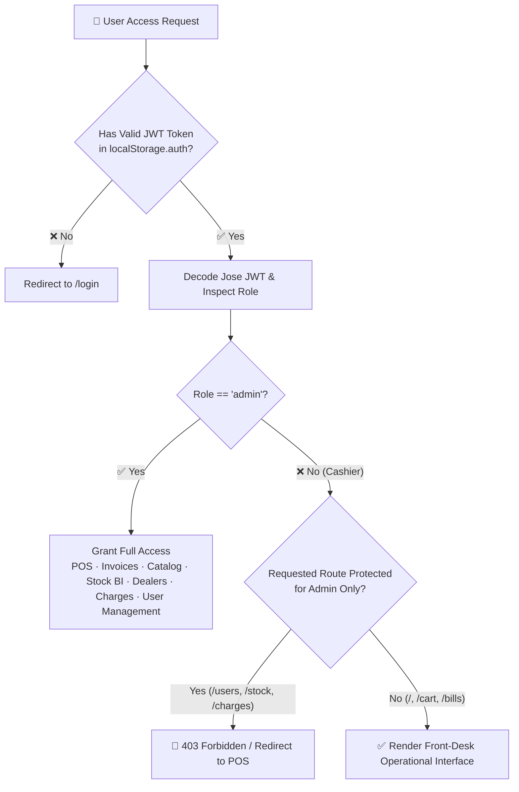
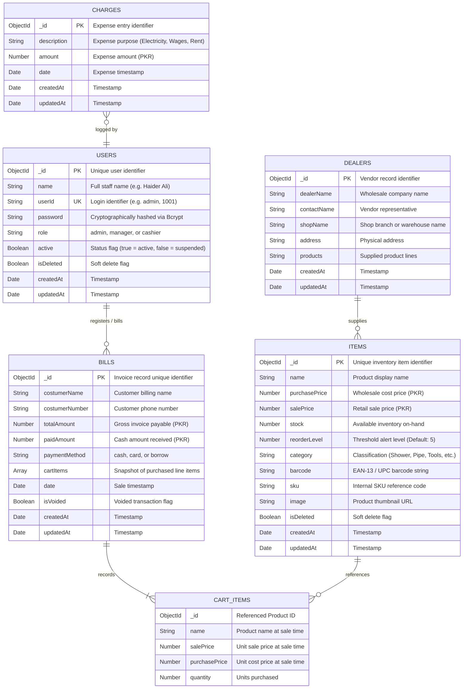

<div align="center">

# 🛒 Hardware Point POS — Enterprise MERN Retail ERP

### Production-Ready, Decoupled Point of Sale with Clean Architecture, Domain-Driven Layering & Offline IndexedDB Resiliency

<p>
  
  
  
  
  
  
  
  
  
</p>

**A production-grade Point of Sale and Inventory Management System engineered for retail hardware shops, sanitary merchants, and electrical distributors. Features Clean Architecture, Domain-Driven Design (DDD), Dexie.js offline-first local checkout, reactive cache invalidation, hardware barcode scanner support, and 80mm thermal receipt printing.**

[Architecture & Design Patterns](#-architecture--software-design-patterns) • [Mermaid Visual Models](#-mermaid-visual-models) • [Folder Structure](#-complete-folder-structure) • [Database Design](#-database-design) • [API Reference](#-api-reference) • [Getting Started](#-getting-started) • [Contributing](#-contributing) • [License](#-license)

---

</div>

> [!IMPORTANT]
> **License Notice**: This software is licensed under the **Hardware Point POS Permission-Based Non-Commercial License**. It is non-paid for approved personal and educational inspection, but **requires prior written permission before usage, deployment, or modification**. Commercial use or resale without written consent is strictly prohibited. See [LICENSE](file:///d:/mern-pos/LICENSE) for terms.

---

## 🎯 Release Highlights & Version Matrix

| Version | Status | Key Highlights |
|:---:|:---:|---|
| **`v2.5.0`** | **Production (Current)** | • **Offline-First Resilience**: Dexie.js 4.4 IndexedDB client database with auto-reconciling background sync.<br>• **Design System Modernization**: Ant Design 5 `<ConfigProvider>` tokens, high-contrast vibrant badges, top-level reactive progress bar.<br>• **Backend Modernization**: Express 5.2.1, Mongoose 8.24, Jose JWT signing, Unit of Work transactional checkout, and EventEmitter pub/sub.<br>• **Hardware Scanner & Thermal Engine**: 80mm ESC/POS roll printing, `F2` barcode focus, and `F4` payment hotkeys.<br>• **Monorepo DX**: Unified root scripts for concurrent client/server dev and database seeding. |
| **`v2.4.0`** | Superseded | 4-Tier Frontend Clean Architecture and Domain-Driven Backend split. |
| **`v2.0.0`** | Superseded | Introduction of JWT Bearer Authentication, Admin User Management panel, and PrivateRoute guards. |
| **`v1.0.0`** | Deprecated | Legacy prototype with monolithic controllers, plain-text credentials, and manual page refreshes. |

---

## 🏛️ Architecture & Software Design Patterns

Hardware Point POS decouples responsibilities across both client and server according to industry-standard patterns:

```
┌──────────────────────────────────────────────────────────────────────────────────┐
│                            CLIENT SPA (REACT 18 & VITE)                          │
│  ┌────────────────────────────────────────────────────────────────────────────┐  │
│  │ Tier 1: Presentation Layer (Ant Design 5 UI, High-Contrast Badges, Layout) │  │
│  └──────────────────────────────────────┬─────────────────────────────────────┘  │
│                                         │ delegates actions & calculations       │
│  ┌──────────────────────────────────────┴─────────────────────────────────────┐  │
│  │ Tier 2: Action Handlers (src/handlers/) & Centralized Error Interception   │  │
│  │ Tier 3: Pure Calculators (src/calculaters/ - Math, COGS, Margins, Formats) │  │
│  └──────────────────────────────────────┬─────────────────────────────────────┘  │
│                                         │ fetches / mutates / syncs              │
│  ┌──────────────────────────────────────┴─────────────────────────────────────┐  │
│  │ Tier 4: Service Layer + Dexie 4 IndexedDB Store + TanStack Query Cache     │  │
│  └──────────────────────────────────────┬─────────────────────────────────────┘  │
└─────────────────────────────────────────┼────────────────────────────────────────┘
                                          │ HTTP / REST (Jose JWT Bearer Auth)
┌─────────────────────────────────────────▼────────────────────────────────────────┐
│                        BACKEND SERVER (EXPRESS 5 & MONGOOSE 8)                   │
│  ┌────────────────────────────────────────────────────────────────────────────┐  │
│  │ Presentation Layer: Modular Controllers, Express 5 Routers, Auth Guards    │  │
│  └──────────────────────────────────────┬─────────────────────────────────────┘  │
│                                         │ calls domain services                  │
│  ┌──────────────────────────────────────┴─────────────────────────────────────┐  │
│  │ Application & Domain: Unit of Work, EventEmitter Pub/Sub, Strategy Pattern │  │
│  └──────────────────────────────────────┬─────────────────────────────────────┘  │
│                                         │ implements repository contracts        │
│  ┌──────────────────────────────────────┴─────────────────────────────────────┐  │
│  │ Infrastructure: Mongoose Repositories, Soft Delete Plugin, Jose Signer     │  │
│  └──────────────────────────────────────┬─────────────────────────────────────┘  │
└─────────────────────────────────────────┼────────────────────────────────────────┘
                                          │ TLS / Replica Set Connection Pool
                               ┌──────────▼──────────┐
                               │    MONGODB ATLAS    │
                               │  Primary & Replicas │
                               └─────────────────────┘
```

### Key Architectural Patterns Implemented

1. **Offline-First & Eventual Consistency**:
   - The client embeds a complete local IndexedDB database powered by **Dexie.js 4.4**. Cashiers can process sales even during internet outages; transactions queue locally and reconcile via `syncEngine.js` once connection returns.
2. **Transactional Unit of Work (ACID Guarantee)**:
   - On the backend, stock decrements and invoice creations are executed inside an atomic `unitOfWork.js` transaction. If an item stock check fails, the entire transaction is aborted.
3. **Pluggable Strategy Patterns**:
   - **Receipt Strategies**: Pluggable formatting for thermal 80mm roll receipts vs. standard A4 tax invoices (`strategies/receipts/`).
   - **Tax Strategies**: Zero-rated, flat percentage, and VAT tax calculation engines (`strategies/tax/`).
4. **Domain Pub/Sub Event Bus**:
   - `AppEvents` (built on Node.js `EventEmitter`) decouples core checkout from secondary concerns like low-stock alerts, audit logging, and webhook broadcasts.
5. **Pure Mathematical Calculators**:
   - Financial algorithms (gross revenue, COGS, net margins, category valuations, tax, tender change) are isolated into pure functions inside `client/src/calculaters/`. They have zero side effects and are 100% testable.

---

## 📊 Mermaid Visual Models

### 1. High-Level Enterprise Topology



---

### 2. POS Transaction & Offline Fallback Sequence



---

### 3. Multi-Role RBAC Authorization Flow



---

## 🗄️ Database Design

### Comprehensive Entity Relationship Diagram (ERD)



---

## 📂 Complete Folder Structure

```
📂 mern-pos/                                      # Monorepo Workspace Root
├── 📄 .env.example                               # Global environment template
├── 📄 CONTRIBUTING.md                            # Contributor guidelines
├── 📄 LICENSE                                    # Custom Permission-Based License
├── 📄 package.json                               # Monorepo scripts (dev:server, dev:client, seed)
├── 📄 README.md                                  # Root architectural blueprint
│
├── 📁 server/                                    # Express 5 & Mongoose 8 Backend
│   ├── 📄 .env.example                           # Server environment blueprint
│   ├── 📄 package.json                           # Dependencies & scripts
│   ├── 📄 app.js                                 # Express 5 application factory
│   ├── 📄 server.js                              # HTTP server lifecycle & DNS resolver
│   ├── 📄 seeders.js                             # Multi-tenant catalog & user seeder
│   └── 📁 src/                                   # Clean Modular Architecture
│       ├── 📁 core/                              # Cross-cutting concerns
│       │   ├── 📁 database/                      # connection.js, tenantManager.js, unitOfWork.js
│       │   ├── 📁 errors/                        # AppError.js & centralized errorHandler.js
│       │   ├── 📁 events/                        # eventEmitter.js & eventTypes.js pub/sub
│       │   ├── 📁 middlewares/                   # authenticate.js, requirePermission.js
│       │   ├── 📁 models/                        # Item.js, Bill.js, Dealer.js, Charge.js, User.js
│       │   └── 📁 security/                      # JoseTokenSigner.js
│       ├── 📁 modules/                           # Feature modules
│       │   ├── 📁 auth/                          # auth.controller.js, auth.routes.js, auth.service.js
│       │   ├── 📁 billing/                       # billing.controller.js, billing.routes.js, billing.service.js
│       │   ├── 📁 inventory/                     # inventory.controller.js, inventory.routes.js
│       │   ├── 📁 expenses/                      # charges & dealers controllers, routes, services
│       │   └── 📁 tenant-admin/                  # tenant & user management controllers, routes
│       └── 📁 strategies/                        # Strategy patterns (receipts/ & tax/)
│
└── 📁 client/                                    # React 18 & Vite Frontend
    ├── 📄 .env.example                           # Frontend environment blueprint
    ├── 📄 package.json                           # Vite 8, React 18, AntD 5, Dexie 4 dependencies
    ├── 📄 vite.config.js                         # Vite build & proxy configuration
    ├── 📄 README.md                              # Dedicated frontend architecture docs
    └── 📁 src/                                   # 4-Tier Clean Frontend Architecture
        ├── 📄 App.jsx                            # ConfigProvider theme tokens & routes
        ├── 📄 index.jsx                          # Root render, TanStack QueryClientProvider
        ├── 📄 index.css                          # Modern typography reset & print rules
        ├── 📁 api/                               # Axios HTTP client with Bearer token interceptor
        ├── 📁 db/                                # Dexie.js 4.4 IndexedDB database (posDatabase.js)
        ├── 📁 services/                          # productService.js, billService.js, syncEngine.js
        ├── 📁 handlers/                          # posHandlers.js, billsHandlers.js, cartHandlers.js
        ├── 📁 calculaters/                       # Pure math: stockCalculations.js, billCalculations.js
        ├── 📁 hooks/                             # usePosQueries.js, useBarcodeScanner.js, usePosShortcuts.js
        ├── 📁 redux/                             # Redux store & persistent cart slice
        ├── 📁 pages/                             # Homepage, Cartpage, Billspage, Itempage, Stockpage, Users
        ├── 📁 components/                        # Defaultlayouts.jsx, PrivateRoute.jsx, ItemsList.jsx
        └── 📁 styles/                            # Pos.css, Defaultlayouts.css
```

---

## 📡 REST API Reference

**Base URL:** `http://localhost:8080/api`

| Module | Method | Endpoint | Access Level | Description |
|---|---|---|:---:|---|
| **Auth** | `POST` | `/users/login` | Public | Authenticate operator, returns Jose JWT & user profile |
| **Auth** | `POST` | `/users/register` | Public | Operator self-registration |
| **Auth** | `POST` | `/users/reset-password` | Public | Credential reset with verification |
| **Users** | `GET` | `/users/get-users` | `admin` | Retrieve all staff accounts |
| **Users** | `POST` | `/users/admin-create` | `admin` | Provision a new operator with role |
| **Users** | `PATCH` | `/users/toggle-status` | `admin` | Suspend or reactivate staff account |
| **Users** | `PATCH` | `/users/update-role` | `admin` | Promote or demote operator (`cashier` / `manager` / `admin`) |
| **Users** | `DELETE` | `/users/delete/:userId` | `admin` | Delete operator account |
| **Catalog** | `GET` | `/items/get-item` | Public | Fetch product catalog with live stock counts |
| **Catalog** | `POST` | `/items/add-item` | Authenticated | Create a new inventory record |
| **Catalog** | `PUT` | `/items/edit-item` | Authenticated | Update product prices, stock, or reorder threshold |
| **Catalog** | `POST` | `/items/delete-item` | Authenticated | Soft-delete inventory item |
| **Billing** | `GET` | `/bill/get-bill` | Authenticated | Retrieve customer invoices and transaction records |
| **Billing** | `POST` | `/bill/add-bill` | Authenticated | Complete checkout with atomic stock decrement |
| **Billing** | `POST` | `/bill/void-bill/:id` | Manager/Admin | Void transaction & restore stock |
| **Dealers** | `GET` | `/dealers/get-dealers` | Authenticated | List all wholesale suppliers |
| **Charges** | `GET` | `/charges/get-charges` | Authenticated | Retrieve store operating expenses |

---

## 🚀 Getting Started

### 1. Prerequisites
- **Node.js**: `v18.x` or `v20.x`
- **npm**: `v9.x` or later
- **MongoDB**: MongoDB Atlas URI or local replica set

### 2. Quick Setup & Installation

From the monorepo root:

```bash
# 1. Install all dependencies across root, client, and server
npm run install:all

# 2. Configure environment files
cp server/.env.example server/.env
cp client/.env.example client/.env

# 3. Seed initial products, store settings, and default admin user
npm run seed
```

### 3. Launch Full-Stack Development

```bash
npm run dev
```

- **Frontend Client**: `http://localhost:3000`
- **Backend API**: `http://localhost:8080`
- **Health Check**: `http://localhost:8080/health`

Default credentials:
- **Admin**: User ID `admin` · Password `test123`
- **Cashier**: User ID `1001` · Password `test123`

---

## 📄 License

This software is governed by the **Hardware Point POS Permission-Based Non-Commercial License**.

- **Permission Required**: You must request and receive prior written consent from author [Haider Ali](https://github.com/Haiderali445) before running, modifying, or distributing this software.
- **Non-Paid**: Free of monetary subscription charges for approved personal, research, and non-commercial educational use.
- **No Commercial Resale**: Commercial redistribution, sale, or SaaS deployment is strictly prohibited without an executed commercial license.

See the full [LICENSE](file:///d:/mern-pos/LICENSE) file for complete terms.

Copyright © 2024–2026 [Haider Ali](https://github.com/Haiderali445). All rights reserved.
